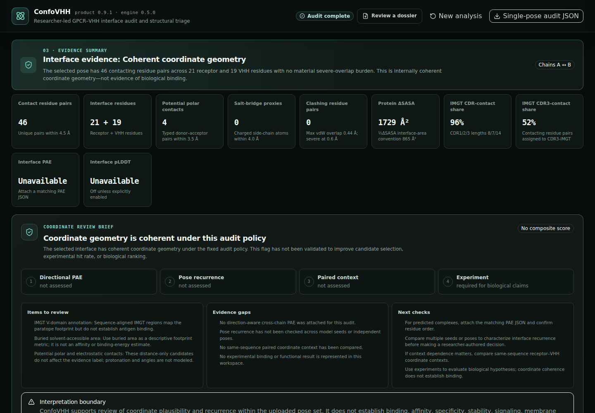
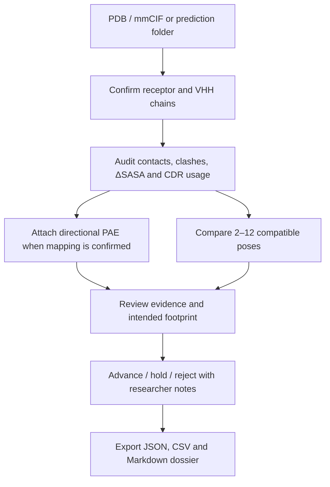

# ConfoVHH

**Local-first structural triage for modeled GPCR–nanobody complexes.**

[](https://github.com/darwinxcai/ConfoVHH/actions/workflows/ci.yml)


[Run it locally](#run-locally) · [Five-minute workflow](#five-minute-workflow) · [Validation record](./VALIDATION.md) · [Release provenance](./PROVENANCE.md) · [How to cite](./CITATION.cff)



*Real v0.9.1 browser run on the SHA-256-pinned public 3P0G coordinate file. These values demonstrate the audit workflow; they are not binding or ranking validation.*

ConfoVHH is a browser-side research application for auditing GPCR–VHH coordinate poses from AlphaFold, ColabFold, and Boltz workflows. It converts raw complex predictions into inspectable interface evidence, pose-recurrence summaries, researcher-authored decisions, and provenance-bound handoff reports.

User-selected coordinates and PAE matrices are processed in the browser tab and are not uploaded by ConfoVHH. The worked example is fetched from RCSB only when requested; the local notebook writes only after an explicit save; exports are downloaded files. Complete audit/dossier exports contain selected protein sequences, residue-level contacts, hashes, and notes, but not raw coordinate text or complete PAE matrices. The application does **not** claim to predict binding, affinity, functional state, membrane compatibility, candidate priority, or pose correctness.

### Scientific status at a glance

| Question | Current answer |
|---|---|
| Can researchers audit real prediction outputs? | **Yes.** The local-first workflow is exercised on genuine AlphaFold Server and ColabFold runs, plus a public GPCR–VHH coordinate panel. |
| Are parsers and geometry calculations regression-tested? | **Yes.** PDB/mmCIF parity, deposited assemblies, exact worker paths, provenance, resource bounds, and adversarial inputs are release-gated. |
| Does the tool order poses, or only measure them? | **It orders them.** Poses of one complex are ranked by shipped evidence tier, then half-ΔSASA interface burial. No fitted coefficients and no thresholds that did not already ship. |
| Does that ordering hold on receptors it was not designed against? | **Yes, on perturbation decoys.** Under a protocol frozen before any pose existed, the rank-1 pose is DockQ-acceptable on 12/12 previously-unused panel receptors; target-macro AP 0.838 against 0.635 for an all-tied control. |
| Is the ranking rule independently validated on realistic hard decoys? | **No.** Every decoy scored so far is a rigid-body perturbation of a solved structure. The formal holdout, whose decoys come from real prediction pipelines, remains unassembled and unexecuted. |
| Does favorable output establish binding, affinity, specificity, signaling, state selectivity, or membrane compatibility? | **No.** Those biological claims remain explicitly false. |
| What is the hard-decoy stop state? | A repeat-fetched 287-entry metadata sub-universe is archived, but all 287 scientific dispositions remain pending; seven groups are provisional, zero are formally cleared, and at least ten are required. |

## Why this project exists

Structure-prediction pipelines can produce many visually plausible GPCR–nanobody poses, but built-in confidence values do not automatically answer whether an interface is physically coherent, CDR-driven, recurrent across seeds, or located at the intended receptor footprint. ConfoVHH makes those questions explicit and auditable without collapsing them into an opaque composite score.

### Core workflow



## What it does

- Parses legacy PDB and PDBx/mmCIF coordinates, including explicit deposited-assembly reconstruction.
- Identifies receptor–VHH contacts, interface residues, geometric clash candidates, and deterministic 960-point Shrake–Rupley ΔSASA.
- Assigns sequence-aligned IMGT framework/CDR regions under the validated v0.6 numbering policy using pinned `immunum 1.3.0`, with exact coordinate-sequence map-back and independent number/segment agreement.
- Maps directional PAE only after explicit model/residue-order confirmation.
- Compares compatible multi-seed pose ensembles by contact, epitope, and paratope recurrence.
- Audits existing AlphaFold Server, local AlphaFold 3, ColabFold, and Boltz output folders.
- Maps user-supplied extracellular, intracellular, transmembrane, and intended receptor footprints without inferring membrane orientation.
- Supports researcher-authored **advance / hold / reject** decisions and notes without inventing a binding score.
- Exports canonical audit JSON, spreadsheet-safe CSV, lab-note Markdown, and complete workspace dossiers with hashes and method provenance.

## Five-minute workflow

ConfoVHH audits prediction outputs; it does not run AlphaFold, ColabFold, or Boltz from FASTA sequences.

1. [Start the app locally](#run-locally) and choose **Load β₂AR–Nb80 demo**.
2. Verify the suggested receptor `A` and VHH `B` chain roles, then explicitly confirm them. Chain suggestions are heuristics, not annotations.
3. Run the interface audit and inspect the geometry flag, metrics, findings, and evidence boundary. The experimental 3P0G example teaches workflow mechanics; it does not measure prediction accuracy.

For a batch, choose the prediction output folder (or matching files), review every coordinate/PAE association, select and audit one reference, return to the run, and analyze the ready poses. ConfoVHH propagates chain roles only through unique exact-sequence matches and rejects ambiguous or changed chains. Researcher **advance for experimental review / hold for manual review / exclude from this set** decisions are stored separately from ConfoVHH evidence.

Boltz coordinates are supported, but native NPZ PAE is inventory-only; continue coordinate-only unless a compatible JSON matrix and its axes/order were independently verified.

### Reading the outputs

| Output | What it describes | What it does not establish |
|---|---|---|
| Contact count / interface residues | Residue pairs within the fixed coordinate cutoff | Binding, specificity, or energetic favorability |
| Severe clashes | Large van der Waals overlaps in the supplied pose | Experimental nonbinding or failed expression |
| ΔSASA | Deterministic approximate buried surface area | Free energy, affinity, or a calibrated ranking score |
| IMGT CDR-contact share | Fraction of coordinate contacts assigned to numbered CDR residues | Epitope correctness or developability |
| Directional PAE | Source-model uncertainty over coordinate-defined contacts | A native predictor score or cross-pose binding rank |
| Pose recurrence | Similar contacts within the uploaded pose set | Correctness, seed independence, or generalization |

Current desktop Chromium, Firefox, and Safari are the intended browsers. CI executes the full browser acceptance and WCAG A/AA scan in Chromium; Firefox and Safari are not yet CI-gated. Single-pose review is responsive on mobile; desktop is recommended for prediction-folder selection and wide evidence tables.

## Run locally

Requirements: Node.js 22.18 or newer.

```bash
git clone https://github.com/darwinxcai/ConfoVHH.git
cd ConfoVHH
npm ci
npm run dev
```

Open the local address printed by the development server, then either load the public β₂AR–Nb80 demo (PDB `3P0G`) or select your own PDB/mmCIF complex. Analysis is performed locally in a Web Worker.

For a production verification run:

```bash
npm run lint
npm test
node scripts/validate-real-prediction-runs.mjs --verify=validation/real-prediction-run-regression-v1.json --quiet
```

## Validation snapshot

| Layer | Current result | Interpretation |
|---|---:|---|
| Ordinary unit/integration tests | 526/526 passed | Complete product, scientific-engine, release-integrity, provenance, and fail-closed protocol suite; 98 tests specifically exercise hard-decoy census/design/request/isolation boundaries |
| Browser acceptance/accessibility | 4/4 Chromium scenarios passed | Initial shell, 390 px mobile reflow, a local-file worker audit with zero off-origin requests, and the SHA-pinned public 3P0G audit/export; all include applicable WCAG A/AA, focus, response-boundary, and report checks |
| Release artifacts | Deterministic tagged-source archive, exact CI-build file-hash manifest, SBOM, provenance receipt, and SHA-256 checksums | Credential-bearing `dist` bytes are not published; the manifest is inspection-only and a fresh verified build from the tag is required for deployment |
| Genuine producer outputs | 2 public runs · 26 source files · 10/10 poses · 10/10 PAE audits | End-to-end compatibility for actual AlphaFold Server and ColabFold outputs |
| PDB↔mmCIF parity | 17/17 structures | Parser/metric reproducibility across serializations |
| Deposited assemblies | 5/5 coordinate oracles | Assembly-operation reconstruction accuracy |
| Native interfaces | 17/17 detected | Positive and obvious-geometry regression coverage |
| Far-translation controls | 102/102 rejected | Zero-interface sanity checks |
| DockQ development ledger | 360/360 poses + 20/20 controls | Benchmark plumbing and descriptive development analysis |
| Local-SE(3) panel extension | 1,222 poses · 17 receptors · 34/34 controls | Cross-receptor ranking evidence on perturbation decoys; primary endpoint is the 12 receptors the pilot never used |
| V3 metadata source archive | 2,065 RCSB union · 1,716 GPCRdb · 287 intersection | Reproducible historical four-term source sub-universe; not an exhaustive candidate universe |
| V3 entry-metadata replay | 2 independent captures · 48 response files · 287 entries · 1,401 polymer entities | Exact normalized agreement across both 12-batch × 2-repeat captures; 287/287 dispositions still pending and no target eligibility |

These counts are software/regression evidence, not a biological performance estimate. The DockQ perturbation sets are development-only. They now establish that the shipped ordering is not specific to the five targets it was designed on — the [panel extension](./validation/panel-extension-v1/) tested it on twelve previously-unused receptors under a protocol frozen in advance, including the criteria that would have counted as failure. They do not establish generalization to the poses a real prediction pipeline produces, because every decoy in both sets is a rigid-body perturbation of a solved structure. No independent leakage-component hard-decoy holdout has yet been assembled or evaluated. The terminal [v2 protocol](./HARD_DECOY_PROTOCOL_V2.md) and original [v1 protocol](./HARD_DECOY_PROTOCOL.md) remain immutable history. The current [v3 protocol](./HARD_DECOY_PROTOCOL_V3.md) specifies a sealed one-way native-epitope oracle, but its request, independent parser/container, key ceremony, leakage graph, targets, labels, and performance analysis are not frozen or executed. See [VALIDATION.md](./VALIDATION.md).

On 2026-08-28, the documented metadata-only screen for the stricter [v2 hard-decoy protocol](./HARD_DECOY_PROTOCOL_V2.md) recorded eight candidate structures resolving to seven provisional public direct GPCR–VHH groups and zero formally cleared groups, against a frozen minimum of ten. Candidate-discovery completeness was not established. No candidate coordinates, DockQ/CAPRI labels, or holdout results were accessed. The minimum was not relaxed, so this is a checksummed [blocked screening checkpoint](./validation/hard-decoy-holdout-v2/prelabel-census/), not an exhaustive census, assembled holdout, upper bound, or performance result.

On 2026-08-29, a second bounded metadata-only audit reviewed 20 recent or previously ambiguous PDB entries and found zero defensible additional independent components. LGR4 and GPR158 entries collapsed into existing groups; the other direct-looking records reused development receptors/VHHs or were auxiliary, fusion, or non-GPCR binders. The checksummed [v3 census audit](./validation/hard-decoy-holdout-v3/census-audit-2026-08-29/) preserves 13 disposition records, sequence hashes, sources, and explicit no-coordinate/no-label access flags. That bounded audit did not retain its own raw responses.

A separate, durable [source snapshot](./validation/hard-decoy-holdout-v3/source-snapshot-2026-08-29/) retains both raw repeats for the four RCSB searches and GPCRdb API/HTML inventories: 2,065 unique RCSB entries, 1,716 GPCRdb entries, and an exact 287-entry intersection. Two independently timed entry-metadata captures—[the already-public capture](./validation/hard-decoy-holdout-v3/entry-metadata-snapshot-2026-08-29/) and a [separate preserved replay](./validation/hard-decoy-holdout-v3/entry-metadata-snapshot-2026-08-29-replay-054318Z/)—each retain 24 raw RCSB GraphQL responses (12 batches × 2 repeats). Their raw bytes and timestamps remain distinct, while all normalized 287 entry rows, 1,401 polymer entities, and 287 triage rows agree exactly. These are a historical four-term metadata sub-universe and triage layer—not an exhaustive candidate universe or eligibility ledger. All 287 scientific dispositions, sequence/parent matrices, native-oracle edges, and the connected-component graph remain incomplete; seven groups remain provisional, zero are cleared, and the minimum remains ten. Source-license mappings and live evidence URLs are recorded in [source-licenses-2026-08-29.json](./validation/hard-decoy-holdout-v3/source-licenses-2026-08-29.json).

The checksummed [v3 oracle design record](./validation/hard-decoy-holdout-v3/design-record/) and [separate leakage-component-out development protocol](./LEAKAGE_COMPONENT_DEVELOPMENT_PROTOCOL.md) are protocol artifacts, not performance evidence. The development study is unexecuted and would require substantial GPU resources; it cannot substitute for the independent holdout.

## Architecture

ConfoVHH is a TypeScript/React application built with Vinext for Cloudflare-compatible deployment. Coordinate parsing, IMGT numbering, ensemble analysis, and per-pose PAE auditing run in bounded browser workers. Canonical reports retain raw-file SHA-256 values, coordinate/geometry fingerprints, parser policy, chain/assembly provenance, and software versions.

The repository's `package.json` and canonical audit version remain `0.5.0` for compatibility with the attested geometry-core lineage. Researcher-facing capabilities advance independently as product release `0.9.1`, while promoted components carry their own versioned records: production VHH numbering and pose ranking are v0.6 policies. Historical v0.5 scientific-core objects and the executed `immunum 1.2.0` distribution remain preserved byte-for-byte, while current production VHH numbering uses pinned `immunum 1.3.0` under the validated v0.6 policy. The current dependency/build environment is separately patched and is not represented as the historical v0.5 lockfile. The checksummed [v0.5 implementation snapshot](./validation/v0.5-engine-implementation-snapshot-v1/) preserves the historical objects, and the [v0.6 implementation snapshot](./validation/v0.6-engine-implementation-snapshot-v1/) binds the scientific-core bytes the current product executes after the numbering promotion. Historical source identifiers are retained in the artifacts and resolve to ancestor commits in the Sites source history used for this product, but those objects are absent from the current public GitHub repository. Release receipts bind the still-verifiable digests to reachable product tags without treating the historical commits as publicly reachable.

```text
app/          researcher workspace and orchestration
components/   prediction-run intake, contact/PAE explorers, state comparison
lib/          parsers, geometry engine, workers, exports, validation contracts
tests/        unit, integration, rendered-output, and worker-runtime tests
validation/   frozen regressions plus checksummed pre-label protocol/census records
scripts/      reproducible public-data and adversarial validation runners
```

## Scientific boundaries

ConfoVHH supports review of **coordinate plausibility and recurrence within an uploaded pose set**. Its geometry flags are not validated candidate-selection or experimental-priority rules. Favorable output is not evidence of binding, affinity, specificity, stability, signaling, receptor-state selectivity, physiological assembly, or membrane compatibility. Experimental validation remains required.

## Author and citation

ConfoVHH is designed, scientifically directed, and maintained by [Darwin Cai](https://github.com/darwinxcai). AI-assisted coding tools have supported implementation, debugging, testing, and documentation under his review; scientific claims and release decisions remain the maintainer's responsibility. Citation metadata are available in [CITATION.cff](./CITATION.cff). See the [security policy](./SECURITY.md), [current dependency-advisory triage](./SECURITY_AUDIT.md), [dependency policy](./DEPENDENCY_POLICY.md), and [provenance model](./PROVENANCE.md) for maintenance and release details. Third-party licenses and attributions are summarized in [THIRD_PARTY_NOTICES.md](./THIRD_PARTY_NOTICES.md).

ConfoVHH source code is released under the [MIT License](./LICENSE). Archived third-party metadata remains under its source license; see [Third-party notices](./THIRD_PARTY_NOTICES.md).

## Product release 0.9.1

The researcher-facing product release is 0.9.1. Its scientific calculations remain source-identical to the attested v0.5.0 core and retain the executed `immunum 1.2.0` bytes; its dependency/build environment is security-patched and is not the historical attested lockfile. The v0.5 public-regression and post-label replay artifacts are unchanged and are not relabeled as new validation.

Release 0.9.1 archives the repeat-fetched v3 metadata source/entry snapshots, selects and hardens the sealed-oracle software contract, and preserves an explicit `DRAFT` integration state with a separately `BLOCKED` target-freeze gate. It adds no holdout performance result or biological claim.

Release 0.9.0 removed automated retain/deprioritize recommendations from the current product display and researcher handoff brief, replacing them with neutral coordinate-geometry flags. Canonical single-audit records retain their raw v0.5 engine fields for reproducibility. The current flags have not been validated to improve candidate selection or experimental hit rate. Researcher-authored decisions remain separate, are cleared whenever a run is recomputed, and are exported with exact coordinate, audit, PAE, and topology evidence bindings. Release 0.9.0 also hardened spreadsheet exports, verified the worked-example checksum, clarified export contents, added response security headers, improved first-use hierarchy and contrast, and introduced browser, accessibility, coverage, Node 24, and release-integrity gates. Release 0.9.1 makes that last boundary explicit: it deterministically packages the tagged source and publishes a file-hash manifest of the exact CI-built bundle, but it does not publish the credential-bearing `dist` bytes. The build manifest is inspection/attestation-only and is not deployable. A deployment must make a fresh verified build from the annotated source tag, which mints new Vinext framework credentials. Independent production recompilation remains unclaimed because those fresh credentials legitimately change bundle bytes and chunk hashes.

Release 0.8 introduced the researcher-authored decision layer and native prediction-run result review. Scientists can search and filter audited poses, record bounded notes, reopen candidates for deeper inspection, and export a provenance-bound shortlist. These decisions are deliberately separate from ConfoVHH evidence fields: the product does not compute or imply a composite binding score.

The product layer adds:

- a task-centered workflow for single-pose audit, optional seed/pose ensemble, optional paired context, and handoff;
- explicit study, receptor, candidate, coordinate-context, intended-footprint, and research-note metadata;
- a deterministic coordinate-review brief derived from the existing evidence band, review findings, selected metrics, and workflow coverage, with no new composite score;
- a searchable, filterable, paginated complete contact explorer and contact CSV export;
- two directional cross-chain PAE heatmaps on shared receptor-Y/VHH-X axes (the reverse block is explicitly transposed for aligned display), sampled contact overlays, both directional medians/P90s, and a conservative ≤10 Å contact share that is explicitly descriptive—not calibrated or a native predictor cutoff;
- user-defined intended receptor-footprint mapping and observed-contact overlap, explicitly not specificity or state compatibility;
- expanded ensemble inspection with the three consensus components, pairwise matrix, and an excluded-pose ledger;
- one strict JSON workspace dossier plus a human-readable Markdown handoff, with exact report/workflow/decision/provenance reconciliation alongside the canonical scientific exports;
- read-only dossier review and an opt-in, versioned local summary notebook;
- explicit cancel, three-minute worker timeouts, guarded reset, coordinate replacement, focused errors/results, skip navigation, and responsive workflow states.
- a native prediction-run intake for AlphaFold Server, local AlphaFold 3, ColabFold, and Boltz output directories, with a bounded scientific-manifest ledger, a separate metadata-only ledger for oversized unsupported binaries, deterministic pairing proposals, explicit researcher confirmation, per-pose PAE quarantine, coordinate-recurrence analysis, and JSON/CSV run exports;
- optional annotated receptor-footprint consistency using mutually exclusive extracellular, intracellular, and transmembrane residue sets supplied by the researcher, without inferring a membrane plane, orientation, accessibility, receptor state, or binding.

The local notebook stores explicitly saved user-entered study context and derived summary metrics. It does not automatically copy loaded coordinate text, parsed sequences, PAE matrices, or residue-contact tables. Notebook imports use exact allowlists and internally reconcile their claimed selection identity, but their metrics, audit fingerprints, and provenance claims are not recomputed or authenticated because a notebook intentionally omits the canonical report and source data. Treat an imported notebook as a schema-checked organizational summary, not scientific evidence. Complete dossier files can contain full canonical result records and contact tables, but no raw coordinate or PAE matrix. Dossier import validates fixed policy text, report structure, result-field attestation, workflow/decision consistency, footprint requests, PAE residue mapping, and cross-report provenance; it does not replay coordinate geometry/PAE values or authenticate the non-cryptographic screening fingerprints. Re-upload coordinates to recompute, extend, or verify an imported analysis.

### Native prediction-run intake

The prediction-run intake introduced in v0.7 scans selected files locally and supports these exact native associations:

| Producer | Coordinate pattern | PAE/confidence pattern used for PAE | Pairing namespace |
|---|---|---|---|
| AlphaFold Server | `fold_<job>_model_<N>.cif` | `fold_<job>_full_data_<N>.json` | relative directory + job + model number |
| Local AlphaFold 3 | `<base>_model.cif` | `<base>_confidences.json` | relative directory + base name |
| ColabFold | `<prefix>_(unrelaxed\|relaxed)_rank_###_<tag>.pdb` | `<prefix>_scores_rank_###_<tag>.json` | relative directory + complete rank/tag |
| Boltz | `<input>_model_N.(cif\|pdb)` | `pae_<input>_model_N.npz` is inventory-only and is not analyzed | relative prediction directory + input + model number |

Filename matching proposes an association; it does not prove that two files came from the same model or that a PAE axis follows coordinate residue order. Every PAE-bearing run therefore requires explicit confirmation after the manifest is reviewed. AlphaFold 3 token metadata is used only when it maps every parsed protein residue uniquely; extra or ambiguous tokens fail closed. A dimension-only matrix still requires researcher confirmation. Summary-confidence JSON is retained as metadata and is never substituted for PAE.

The public generated-output regression downloads and verifies exact SHA-256 values for two genuine five-model runs: a CC-BY-4.0 [ColabFold-multimer dataset](https://zenodo.org/records/17063524) and the commit-pinned [AF3_MiniPAE AlphaFold Server example](https://github.com/martinovein/AF3_MiniPAE/tree/a7458d1d26a35154cbfc3e24ec197352079970df/data/example/p06730_o60516). All 10 coordinates, all 10 matched PAE sources, manifest pairing, exact-sequence chain propagation, recurrence, contact/clash/ΔSASA calculation, and per-pose export records completed. These two compatibility controls are not GPCR–VHH systems and do not add biological or ranking validation; domain-specific geometry regression remains the separate 17-structure public GPCR–VHH panel.

A directory or multi-file selection may contain at most 512 entries. From that selection, at most 128 bounded recognized/readable files can enter one scientific manifest, including no more than 12 coordinate poses. Supported coordinate text is limited to 12 MiB per file, JSON to 16 MiB per file, aggregate coordinate text to 48 MiB, selected PAE JSON attachments to 48 MiB aggregate, and recognized/readable manifest content to 96 MiB. A supported text candidate that exceeds its individual limit stops intake. An oversized unsupported binary is instead retained only as a local skipped-file record containing its relative path, byte count, and reason; it is not read, hashed, or included in the scientific manifest or run dossier. Bounded NPZ and pickle files may be hashed and inventoried in the manifest, but they are never decoded, deserialized, or executed. Duplicate coordinate digests, ambiguous relaxed/unrelaxed variants, reused PAE files, path traversal, invisible/control characters, disguised content, and unresolved pairings block analysis until explicitly resolved.

Coordinate recurrence is calculated first by the unchanged v0.5 ensemble engine. PAE remains exact per-pose context: each retained pose is audited only with its explicitly associated PAE source, and no PAE source or summary is pooled, transferred, or substituted across poses. A missing, malformed, or unmappable PAE source is recorded for that pose as not provided or rejected and cannot silently become another pose's confidence input. PAE never changes recurrence rank or coordinate evidence band. The run dossier contains the resolved bounded manifest, hashes, pairing basis, rejection ledgers, canonical reports, and optional topology summaries, but excludes raw coordinate text, PAE matrices, and the metadata-only records for oversized unsupported binaries that never entered the manifest.

## v0.5 scope

### Coordinate ingestion and provenance

- reads legacy PDB (`.pdb`, `.ent`) and PDBx/mmCIF (`.cif`, `.mmcif`) coordinate text;
- uses recognized filename extensions first and content sniffing as a fallback for unknown extensions; malformed input fails closed;
- parses the selected actual model identifier rather than assuming that model IDs start at one;
- preserves PDBx/mmCIF `label_asym_id` and depositor-facing `auth_asym_id` separately;
- inventories deposited assembly annotations and reconstructs only an explicitly selected assembly;
- expands operation lists, numeric ranges, and Cartesian products without evaluating code;
- gives every generated chain copy an opaque unique identity and records its source asym ID, generator row, operation tuple, and composite transform;
- analyzes protein-heavy-atom records only and reports nonprotein components omitted during assembly materialization;
- records SHA-256 over the original file bytes separately from both a source-frame selected-coordinate fingerprint and an SE(3)-canonical selected-geometry fingerprint;
- rejects source coordinates outside ±10,000,000 Å before geometry analysis;
- performs coordinate and PAE parsing in a Web Worker with bounded input, atom, protein-chain, chain-copy, model, assembly, operation-expression, and PAE-matrix limits.

“Deposited assembly” means a depositor/PDB-supplied annotation. Applying its operators does not determine whether that assembly is physiological, and ConfoVHH does not generate additional crystallographic symmetry mates.

### Interface audit

- unique receptor–VHH residue contacts within 4.5 Å;
- interface-residue counts on each chain;
- distance-only donor–acceptor and acidic/basic proximity candidates;
- element-specific severe van der Waals overlaps and a narrow interchain-disulfide exemption;
- occupancy-aware, coherent residue-level alternate-conformer selection;
- parser diagnostics for malformed, duplicate, unsupported, zero-occupancy, and conflicting records;
- deterministic 960-point Shrake–Rupley protein-heavy-atom ΔSASA and the descriptive \(\frac{1}{2}\Delta SASA\) interface-area convention;
- formal sequence-aligned IMGT numbering and CDR/interface mapping using exactly pinned `immunum 1.2.0`;
- optional directional interface PAE from a dimension-matched JSON matrix after explicit residue-order confirmation;
- optional interface pLDDT only when the user confirms that the coordinate B-factor field stores pLDDT.

Single-audit contact, distance, overlap, PAE, pLDDT, and approximate SASA calculations use the selected source coordinates exactly as supplied or materialized. Multi-file ensemble and paired jobs keep contacts, distances, clashes, and provenance in each source frame but make an in-memory deterministic proper-signed rigid-frame clone for approximate SASA only. The clone is not exported as a changed structure and is not used for contact decisions. The policy records `selected-heavy-atom-farthest-signed-frame-v1` as the SASA-frame algorithm. This split-frame policy has tested numerical stability under broad rigid transforms while preserving exact source-frame distance boundaries; finite-grid anchor ties can still cause small ΔSASA changes and remain explicitly warned about.

SASA work fails closed before unbounded computation. Each audit permits at most 25,000,000 candidate atom-distance checks while building partner-neighbor lists and at most 250,000,000 surface-point occlusion checks. These are computational safety bounds, not scientific thresholds.

PAE is disabled after deposited-assembly expansion because a matrix for the supplied asymmetric coordinates cannot safely be reused across generated chain copies. PAE input is limited to 16 MiB of source text and a square matrix of at most 1,500 residues; container, nesting, entry-count, dimension, and finite-value preflights fail at the first exceeded bound. The matrix is stored as a row-major `Float32Array`, parsed off the main thread, and transferred rather than duplicated.

### Multi-pose comparison

ConfoVHH compares a selected reference coordinate scope with 1–11 as-supplied PDB and/or PDBx/mmCIF candidates when the observed receptor and VHH sequences match the explicitly selected reference pair exactly. Candidate files are parsed independently and assigned only when exact observed-sequence matching is unique; chain IDs may differ. The selected receptor–VHH heavy-atom identity inventory must also match the reference exactly, so an otherwise sequence-identical pose with missing side-chain atoms can be rejected. It reports contact-pair, receptor-epitope, and VHH-paratope Jaccard recurrence, then assigns a deterministic rank in this order:

1. higher ensemble consensus;
2. lower severe-clash burden.

Poses tied on both scientific criteria receive the same competition rank; the stable code-unit pose identifier controls display order only. The visible `triageGroup` is a descriptive coordinate-geometry band derived from the single-pose evidence level. It and ΔSASA remain report metadata; neither controls ensemble rank. Rank is therefore recurrence-first, not an estimate of binding or native-pose correctness.

Every pose retains source format, model ID, coordinate scope, assembly ID, label/auth chain identities, copy/operator provenance, raw-byte SHA-256, a source-frame selected-coordinate fingerprint, and a separate SE(3)-canonical selected-geometry fingerprint. Duplicate membership is resolved as connected components of proper-rotation fit edges, so non-transitive chains of near-duplicates do not depend on upload order. The reference is privileged in its component; every candidate-only component retains a deterministic geometry medoid. Duplicate nonrepresentatives are removed before interface ledgers are allocated. The proper-rotation duplicate check requires a fitted heavy-atom RMSD ≤0.02 Å and maximum residual ≤0.05 Å; reflected coordinates do not pass. JSON and CSV reports use application export schema 1.2 with an explicit software version and audit-policy fingerprint, and CSV fields are neutralized against spreadsheet-formula injection.

The coordinate and geometry fingerprints are deterministic screening/provenance identifiers, not cryptographic identity proofs: they use FNV-1a and the geometry form rounds canonical coordinates to 0.01 Å. Raw-file SHA-256 remains the cryptographic byte-level identifier.

Consensus measures recurrence inside the uploaded set, not correctness. Correlated seeds and near-duplicates can inflate it, and a consistently wrong pose can recur. PAE and B-factor-derived pLDDT are completely omitted from ensemble comparison, including per-contact confidence, so all poses use the same coordinate-only policy.

### Paired coordinate-context comparison

The state-context workspace compares one explicitly selected receptor–VHH pair from the reference file with a uniquely assigned comparison pair after independent parsing and exact observed-sequence matching. It requires unambiguous, exact equality of both observed receptor sequences and both observed VHH sequences; the comparison chain IDs need not match the reference chain IDs. The current rigid-duplicate gate additionally requires the selected receptor–VHH heavy-atom identity inventories to correspond exactly; equal sequences alone do not guarantee pair eligibility. It reports:

- signed contact, clash, and approximate ΔSASA changes, always defined as **comparison minus reference**;
- contact-pair, receptor-epitope, and VHH-paratope Jaccard similarity;
- shared, reference-only, and comparison-only residue contacts;
- the separate audit and full coordinate provenance for each side;
- optional user labels that are retained as descriptive metadata only.

The single-audit JSON report, ensemble JSON/CSV reports, and paired JSON/CSV reports use application export schema 1.2. Paired JSON and long-form CSV both include all shared, reference-only, and comparison-only contact records, along with the SASA orientation policy, sphere-point count, 25,000,000 candidate-distance bound, and 250,000,000 surface-point-occlusion bound. Paired comparison has no rejection ledger in either format: a failed pair produces an error instead of an accepted summary export.

The same proper-rotation fit used for ensemble deduplication rejects a rigidly equivalent pair before comparison. The feature does not align one biological interface onto the other, infer an active or inactive receptor state, estimate conformational preference, or validate state-selective binding. A favorable signed change is not evidence that one condition binds better.

Reference/comparison labels are optional user-supplied metadata only. Paired jobs accept and use no PAE, B-factor-derived pLDDT, or per-contact confidence values; confidence fields in the coordinate-only audits must be null.

Each condition's approximate SASA is evaluated in its own deterministic canonical clone. Small ΔSASA differences can reflect finite sphere-grid orientation or a canonical-anchor switch and must not be interpreted as energetic changes.

## Evidence boundaries

The evidence band describes internal coordinate coherence. It is not a probability, energy, or calibrated decision threshold. Favorable geometry does not establish:

- experimental binding or nonbinding;
- affinity, specificity, kinetics, or developability;
- agonism, antagonism, signaling, or receptor-state selectivity;
- membrane compatibility or physiological assembly;
- correctness relative to an unknown native complex.

## Validation status

The release suite combines offline unit/integration tests with distinct public-data exercises. They answer different questions and are never pooled into one performance claim.

The public-panel counts below were reproduced from a clean tree retaining legacy source identifier `5cb57617b54baa314513486885c402449f643406` and are recorded with raw-source, implementation, and executed-`immunum` hashes in `validation/v0.5-public-regression-attestation-v1/`. That commit is an ancestor in the Sites source history used for this product, but it is absent from the current public GitHub repository and cannot be resolved there. The recorded digests remain verifiable and are bound forward through reachable product-release receipts.

| Exercise | Result | What it supports | What it does not support |
|---|---:|---|---|
| PDB↔PDBx/mmCIF native serialization parity | 17/17 exact atom, residue, contact, and clash/evidence matches; ΔSASA parity within 1×10⁻⁹ Ų | parser normalization and metric reproducibility | docking or binding discrimination |
| Deposited-assembly reconstruction | 5/5 official assembly oracles matched; maximum coordinate error <0.00078 Å | operation parsing, composition, and chain-copy provenance | physiological oligomerization |
| Public native-interface regression panel | 17/17 interfaces detected; 17/17 translations preserved contacts/ΔSASA; 102/102 far translations returned zero contacts/ΔSASA | native-interface and obvious-geometry regression | realistic negatives or near-native ranking |
| Public state-context coverage inventory | 4/4 native interfaces represented in 2 receptor-context pairs; 0 same-VHH cross-context pairs | regression coverage for the four individual coordinate audits | state discrimination, state selectivity, or same-VHH context transfer |
| Local-SE(3) DockQ development pilot | 360/360 poses scored; all 20 controls/cross-checks passed | deterministic generation, DockQ labeling, tie-aware aggregation, and provenance plumbing | locked holdout, blind docking, or near-native validation |
| v0.5 post-label DockQ regression replay | 360/360 exact coordinates, non-SASA audits, DockQ records, and CAPRI labels; 360/360 SASA audits within fixed tolerance; 20/20 controls/cross-checks | no unintended software regression detected on the previously labeled development ledger | new evidence, independent validation, or generalization |

The development-only DockQ pilot reused five public complexes already present in development data. At DockQ ≥0.23, target-macro AP was 0.688 for the categorical ConfoVHH evidence band, 0.636 for the all-tied prevalence baseline, and 0.773 for raw ΔSASA. Corresponding AUROCs were 0.574, 0.500, and 0.754. This narrow, high-positive-prevalence perturbation grid therefore does not justify a near-native-ranking claim. The complete frozen v0.4 specification, source-integrity manifest, 360-pose ledger, per-target results, 10,000-replicate tie-aware bootstrap summaries, implementation/DockQ/Python provenance, and checksums remain byte-for-byte frozen in `validation/dockq-development-pilot-v1/`.

The v0.5 replay retained legacy source identifier `278ae1a74da133778fba5b17bc296a8e37f02e76` and is recorded separately in `validation/dockq-v0.5-regression-replay-v1/`; that commit is likewise an ancestor in the Sites source history but absent from the current public GitHub repository. It reproduced all discrete records exactly; maximum ΔSASA drift was 1.03×10⁻¹⁰ Ų against the 1×10⁻⁹ Ų bound fixed before the full 360-pose scan. It reuses already observed DockQ labels only to detect software regression and is not a second experiment. The public state-context inventory is in `validation/state-context-native-regression-v1.json` and contains zero same-VHH cross-context examples.

No independent leakage-component hard-decoy dataset exists for this release; none has been assembled, labeled, frozen, opened, or evaluated. The terminal [hard-decoy v2 protocol](./HARD_DECOY_PROTOCOL_V2.md) remains blocked before target freeze at seven provisional groups, zero formally cleared groups, and a minimum of ten. The current [v3 protocol](./HARD_DECOY_PROTOCOL_V3.md) resolves the logical epitope-blinding design with a sealed one-way oracle, but the oracle request, independent implementation/container, key ceremony, leakage graph, target set, and execution remain unfrozen. It must not be described as an existing dataset or completed study.

The separate [v2 pre-label census](./validation/hard-decoy-holdout-v2/prelabel-census/) is deliberately blocked before target freeze: its documented screen contains seven provisional and zero formally cleared groups, below the preregistered minimum of ten; candidate discovery remains incomplete. It does not change any validation claim above.

The [2026-08-29 bounded v3 metadata audit](./validation/hard-decoy-holdout-v3/census-audit-2026-08-29/) adds 13 reproducible dispositions covering 20 PDB entries and finds zero new components. That bounded audit did not preserve its own raw HTTP responses. Separate source and entry-metadata snapshots now retain repeated raw responses for the frozen 287-entry four-term sub-universe, but the full scientific disposition ledger and broader discovery routes remain incomplete. This is negative screening and provenance evidence—not a frozen target census or proof that no future targets can exist.

See [VALIDATION.md](./VALIDATION.md) for methods, frozen expectations, digest attestations, and public-history limitations.

## Local commands

ConfoVHH requires Node.js 22.18.0 or newer.

```bash
npm run dev
npm run lint
npm run typecheck
node --test tests/*.test.mjs
npm test
npm run test:release
npm run test:adversarial
npm ci --prefix qa
./qa/node_modules/.bin/playwright install chromium
./qa/node_modules/.bin/c8 --all --include='lib/**/*.ts' --check-coverage --statements=60 --lines=60 --branches=80 --functions=50 node --test tests/*.test.mjs
npm --prefix qa test
npm run test:mmcif
npm run test:benchmark
```

The DockQ exercises additionally require pinned DockQ 2.1.3:

```bash
python3 -m venv .bench-venv
CC=gcc .bench-venv/bin/pip install "DockQ==2.1.3"
npm run test:dockq-pilot
npm run test:dockq-replay
```

`npm run test:mmcif` and `npm run test:benchmark` download public RCSB files and are intentionally separate from the offline release suite. `npm run test:public-attestation` is the archival, non-overwriting v0.5 evidence generator—not a current clean-clone verification command—and is expected to refuse while its frozen target artifact already exists. The DockQ runners are likewise historical reconstruction tools: the v0.4 pilot requires the v0.4 source tree, and the post-label v0.5 replay must never replace its frozen output. Use the ordinary, adversarial, browser, direct public-data, and genuine-producer commands above for current product verification.

The app includes a public experimental demo based on the β₂AR–Nb80 complex [RCSB PDB 3P0G](https://www.rcsb.org/structure/3P0G). Coordinate and PAE analysis occurs locally in the browser; unpublished structures are not required for the bundled examples or validation records.
