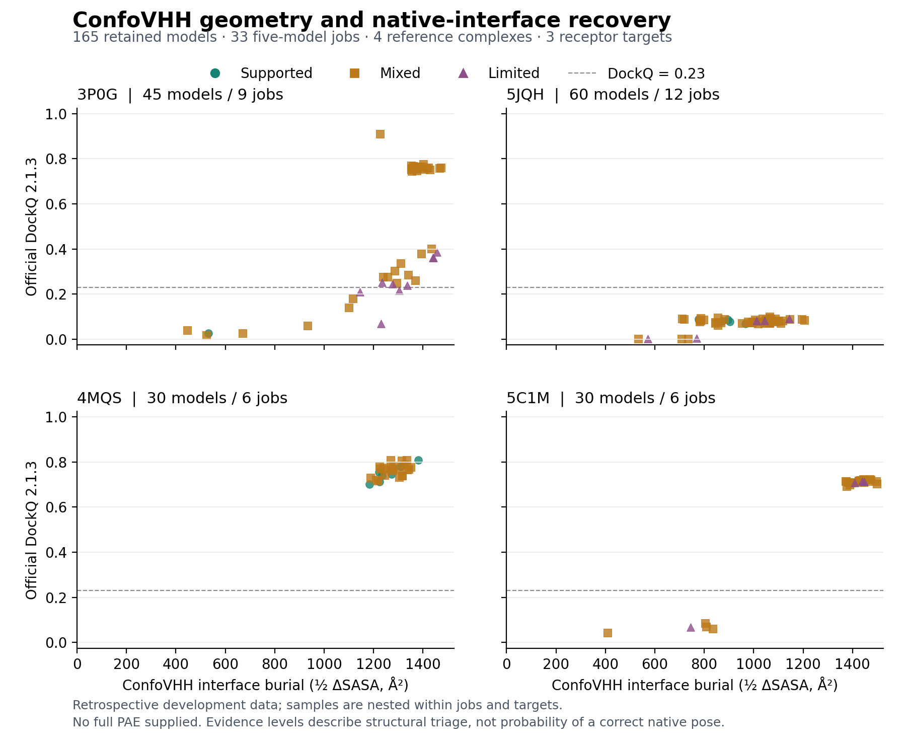

# ConfoVHH: reproducible review of predicted GPCR–nanobody interfaces

Darwin Cai

Working manuscript, 5 September 2026. This draft integrates the completed
retrospective GPCR application and subsequent selection audit. It is not a
submitted manuscript or a claim of independent biological validation.
Affiliation, contributions, funding, competing interests, and venue-specific
formatting require completion before submission.

## Abstract

ConfoVHH is a browser-based workspace for documenting structural evidence in
predicted GPCR–nanobody complexes. It combines explicit chain assignment,
interface contacts, burial, clashes, numbered CDR participation, compatible
pose recurrence, and provenance-preserving exports. We applied the unchanged
implementation to 165 retained cognate predictions from 33 five-model jobs,
15 conditions, four reference complexes, and three receptor targets, and
paired its outputs with official DockQ 2.1.3. Eight of fifteen supported
geometry flags occurred below DockQ 0.23, demonstrating that this flag cannot
be used as a native-pose classification in the observed set. ConfoVHH selected
an acceptable interface in 18 of 33 jobs, compared with 19 for maximum
exported predictor score and an analytical uniform-selection expectation of
18. Only four jobs contained both acceptable and poor candidates; all four
concerned 3P0G. These retrospective observations support a traceable workflow
for inspecting model evidence, but do not establish improved native-pose
selection. Missing coordinates for 85 additional preliminary cognate models,
absent full PAE, and limited target coverage constrain interpretation.

## Introduction

Nanobodies provide experimentally established tools for studying GPCR
conformations. The β₂-adrenoceptor (β₂AR) structure 3P0G captured an
agonist-bound active state with Nb80. A different reference, 5JQH, contains
β₂AR with Nb60 and carazolol in an inactive conformation. These experiments
motivate evaluating both receptor geometry and the receptor–VHH interface;
the two structures differ in binder and ligand as well as conformation.
[Rasmussen et al., 2011](https://doi.org/10.1038/nature09648);
[Staus et al., 2016](https://doi.org/10.1038/nature18636).

AlphaFold 3 extends structure prediction to complexes containing several
molecular types, including antibody–antigen complexes, and reports confidence
estimates for its generated coordinates. Its published results depend on
sampling and ranking procedures. The present work addresses the subsequent
review of existing predictions, using a small retained development corpus;
it does not reproduce that predictor benchmark.
[Abramson et al., 2024](https://doi.org/10.1038/s41586-024-07487-w).

We designed ConfoVHH to make the evidence underlying an interface review
inspectable and exportable. Here we describe its application to genuine
GPCR–VHH predictions and compare its outputs with deposited-interface recovery.
DockQ supplies that reference-dependent comparison, combining recovery of
native contacts with interface and ligand backbone deviations.
[Mirabello and Wallner, 2024](https://doi.org/10.1093/bioinformatics/btae586).
The central questions are whether the application preserves model identity
and missing-evidence information, how its geometry flags relate to native
recovery, and what its unchanged ranking selects from the retained candidates.

## Software and research workflow

ConfoVHH takes existing complex predictions as input. Researchers confirm
receptor and VHH chain roles, inspect interface evidence, compare compatible
poses, and record review decisions with notes. Coordinate parsing, VHH
numbering, geometry analysis, PAE processing when available, and comparison
run in browser Web Workers. JSON, CSV, and Markdown exports retain source
hashes and method provenance. The application does not generate structures.
Its implemented behavior and input formats are documented in the
[software repository](https://github.com/darwinxcai/ConfoVHH).

The workspace exposes two complementary comparisons: a pose order based on
coordinate evidence, and an ensemble view based on recurrence and clash
burden. Intended receptor footprints are supplied by the researcher; the
software does not infer membrane orientation or full receptor state.
Directional PAE requires explicit confirmation of matrix-to-residue order.
For the present cohort, only coordinate evidence entered ConfoVHH ranking.

## Methods

### Retrospective corpus and inclusion

The supplied AlphaFold Server corpus comprised 460 model records from 92 jobs
and 31 input conditions. Each submitted job requested one seed and retained
five model records. Three verification archives contained 355 model coordinate
files from 71 jobs. The recovered master metrics matched the current source
CSV row for row. Original request and coordinate bytes were bound by SHA-256
digests. Coordinates were available for 165 of 250 preliminary cognate models,
all 60 swapped/irrelevant-binder controls, and 130 of 150 receptor-only models.
The control models were excluded from cognate-interface scoring because their
submitted binder did not match the deposited binder reference. Receptor-only
models were not assigned an interface score.

The retained cognate cohort consisted of 165 models from 33 jobs and 15
conditions, representing four deposited complexes across three receptor
targets. Eligibility was determined from retained files, request identity,
reference provenance, and sequence compatibility, without consulting the new
official DockQ scores. Both predicted protein chains matched their respective
submitted sequences exactly. Observed native sequences were covered completely
as ordered subsequences of the corresponding model sequences. Chain roles
were explicit: notably, the native 5JQH VHH uses author chain C, whereas its
label chain is D. Sequence compatibility supports reference use but does not
prove biological binding or eliminate alignment ambiguity. This corpus had
already been examined during development and was not treated as a held-out
test set.

### Official interface scoring

Native-interface recovery was recomputed using unmodified DockQ 2.1.3 with
default protein-interface definitions, sequence alignment enabled, and fixed
native-to-model receptor/binder chain maps. Original CIF and gzipped CIF files
were parsed directly. No chain-map optimization was used. Known memoization
caches were cleared between models. The exact dependency versions, source
archive hash, installed source files, and locally compiled binary fingerprint
were recorded. All 165 models passed input preflight and scoring without a
failure. Native self-comparisons and 100 Å translated-binder controls passed
for all four references. Five genuine prediction cases covering each distinct
reference/chain mapping produced matching official API and CLI results.
These controls verify the invocation and file mapping; they are not a second
independent implementation of DockQ.

The handoff's earlier custom score used Cα RMSDs and a modified interface
definition. It is retained as `legacy_custom_score` and is not identified as
standard DockQ. The official 0.23 boundary is used only for official scores.
The standard implementation excludes native 5C1M HETATM residue YCM57 from its
protein representation. The independent sequence review mapped YCM to cysteine
solely to document correspondence; the scored coordinate files were unchanged.
DockQ methodology and implementation are described by
[Basu and Wallner](https://journals.plos.org/plosone/article?id=10.1371/journal.pone.0161879)
and [Mirabello and Wallner](https://doi.org/10.1093/bioinformatics/btae586),
with implementation details in the
[official DockQ repository](https://github.com/wallnerlab/DockQ).

### ConfoVHH application and endpoint reproduction

The same 165 coordinate files were audited using ConfoVHH product release
0.9.1, geometry engine 0.5.0, ranking policy 0.6.0, and immunum 1.3.0. These
version labels refer to distinct implementation layers. Each five-model job
was analyzed separately, with model 0 supplying explicitly reviewed reference
chain selectors for within-run correspondence. Here, the reference pose is a
predicted model used for correspondence, not the deposited native structure.
For every model, parsed receptor and VHH sequences were checked against the
role-specific submitted sequence hashes. All models were accepted and all VHHs
were numbered. Interface metrics, evidence flags, ranks, and recurrence were
exported through the production implementation; no threshold, weight, or
ranking policy was adjusted using the new DockQ results.

None of the 165 models had a retained full-data PAE matrix. All had confidence
summary JSON, which was hashed for inventory and excluded from PAE and
ConfoVHH ranking. Source ipTM and producer ranking scores were retained as
separately labeled context. Recurrence compares samples within each five-model
job and cannot be interpreted as independent recurrence across seeds.

The declared receptor endpoint readout was independently recomputed for all
355 retained coordinate files and six deposited references. A separate
Biopython mmCIF dictionary parser identified the unique receptor bearing the
declared DRY-like and CWxP-like motifs. Each predicted receptor sequence was
checked against its submission; deposited references used the explicit
receptor chain selectors in the reference provenance table. The measurement
was the Euclidean Cα distance from the R/K in
D[RK]Y to the residue sixteen sequence positions before the proline in
[CTS]W[A-Z]P. Selected endpoint residues, atom coordinates, chain identifiers,
and hashes were retained. This reproduces the supplied coarse geometric
readout; it does not independently validate generic-position assignments or
infer the receptor's complete functional state.

### Descriptive within-job selection analysis

We compared model-selection rules using 165 retained cognate predictions
from 33 five-model jobs, spanning 15 conditions, four reference complexes,
and three receptor targets. The preceding audit had calculated official
DockQ 2.1.3 against explicitly reviewed cognate references and applied the
unchanged ConfoVHH production implementation to the same coordinates.
Here, we reused those paired results without generating predictions, changing
the ranking policy, or fitting a threshold. Interface acceptability was
defined by the existing DockQ boundary of 0.23.

For each job, the ConfoVHH choice was the model with the lowest recorded
evidence rank. There were no tied top ConfoVHH ranks. The exported-score
baseline retained all models attaining the maximum recorded `ranking_score`.
We verified all 165 exported values against their original
`summary_confidences_i.json` files and the file hashes recorded in the
preceding audit. The values agreed exactly, but their numerical precision
was at most two decimal places. Neither unrounded internal scores nor the
producer's original tie-breaking policy was available. Thus this baseline
represents maximum exported score, rather than an identified producer-selected
pose. We preserved every maximal-score tie and assigned equal weight to tied
models when calculating expectations.

We also calculated the analytical expectation of selecting uniformly among
the five candidates and a hindsight ceiling obtained by choosing the highest
official DockQ. The latter uses native-reference outcomes and is not a
deployable method. Expected acceptable counts were summed over jobs;
selected DockQ means weighted each job equally. Minimum and maximum outcomes
were obtained from the least and most favorable permitted choice within each
job. These are possible-outcome bounds, not confidence intervals. Uniform and
tie-weighted expectations involved no random draws. We reported results by
reference complex and separately identified jobs with candidates on both
sides of the acceptability boundary.

## Results

### Paired interface and receptor measurements

All 355 recomputed endpoint measurements reproduced the source CSV to its
reported precision of 0.001 Å. Official interface rescoring changed numerical
values, but no retained model crossed the 0.23 boundary relative to its earlier
numerical position. Seventeen 4MQS models that had previously occupied the
custom score's high bin instead received official medium-quality labels. The
largest absolute correction was 0.0820. This comparison audits earlier labels;
it does not validate applying standard categories to the custom score.

Of the retained models, 35/45 for 3P0G, 0/60 for 5JQH, 30/30 for 4MQS, and
25/30 for 5C1M reached official DockQ 0.23. Corresponding median official
scores were 0.3803, 0.0806, 0.7679, and 0.7112. These are descriptive model
counts within four systems, not independent estimates of predictor accuracy.

The retained 5JQH results provide a direct example of the distinction between
the receptor endpoint and interface recovery. The fifteen models in the
pre-2011 rescue condition had a mean endpoint distance of 8.3429 Å, compared
with 8.0716 Å for the deposited reference. Their mean official DockQ was
0.07193, and none reached 0.23. The available five-model default job had a mean
distance of 15.1088 Å and mean DockQ 0.08506. Thus, an endpoint nearer the
deposited value co-occurred with poor recovery of the deposited VHH interface.
These measurements support separating the two readouts; they do not by
themselves establish a causal template mechanism or full receptor-state
prediction capability.

ConfoVHH assigned 15 supported, 131 mixed, and 19 limited geometry flags. Eight
of the fifteen supported flags occurred in models below DockQ 0.23: seven
5JQH models and one 3P0G model. Conversely, a native-like interface could carry
geometry cautions. The observed discordance supports the software's stated
interpretation of its flags as structured evidence for review. It does not
support using them as native-pose classifications or calibrated probabilities.
The paired figure includes all 165 measured models; no values are drawn from
an illustrative mockup.

### Selection behavior and candidate availability

Of the 33 jobs, 16 had five acceptable candidates, 13 had none, and four had
a mixture. All four mixed jobs came from 3P0G, across two conditions. The 13
jobs with no acceptable candidate comprised all 12 5JQH jobs and one 5C1M job.
Their retained candidate sets therefore offered no possibility of an
acceptable top selection, placing the overall hindsight ceiling at 20 jobs.

| Selection rule | Acceptable count / 33 | Possible count range | Equal-job mean DockQ | Possible mean DockQ range |
|---|---:|---:|---:|---:|
| ConfoVHH | 18 | 18–18 | 0.405619 | 0.405619–0.405619 |
| Maximum exported score, equal-weight ties | 19 | 19–19 | 0.412419 | 0.406546–0.419039 |
| Uniform selection, analytical expectation | 18 | 16–20 | 0.402137 | 0.364050–0.439690 |
| Highest DockQ, hindsight | 20 | 20–20 | 0.439690 | 0.439690–0.439690 |

Table values for DockQ are rounded to six decimal places. Counts in the
uniform-selection row are expectations, not observed random-selection
outcomes. Exported-score maxima were tied in 22 jobs. No tied maximal-score
set crossed the acceptability boundary, so any resolution of those ties
produced the same binary count, while selected DockQ varied within the
reported bounds.

| Reference complex | Jobs | Mixed jobs | ConfoVHH acceptable | Maximum exported score | Uniform expected | Hindsight best |
|---|---:|---:|---:|---:|---:|---:|
| 3P0G | 9 | 4 | 7 | 8 | 7 | 9 |
| 4MQS | 6 | 0 | 6 | 6 | 6 | 6 |
| 5C1M | 6 | 0 | 5 | 5 | 5 | 5 |
| 5JQH | 12 | 0 | 0 | 0 | 0 | 0 |

Among the four mixed jobs, ConfoVHH selected an acceptable model in two,
compared with three for maximum exported score, two expected under uniform
selection, and four under hindsight selection. In
`3P0G_recOFF_nbON_complex_seed2`, ConfoVHH selected model 4 with DockQ
0.018424, whereas both exported-score maxima, models 0 and 1, were acceptable
(DockQ 0.252411 and 0.245017). In the corresponding seed 3 job, both rules
selected below threshold despite two acceptable alternatives. ConfoVHH's
selected model 2 had DockQ 0.026969 and a `supported` geometry flag in the
preceding audit. Across all 33 jobs, binary selection outcomes agreed in 32
and favored the exported-score baseline in one. These observations do not
support a claim of ConfoVHH selection superiority in this set.

## Figure 1

**ConfoVHH interface geometry and native-interface recovery in retained GPCR
predictions.** Each point is one retained model, plotted directly from the
hash-verified paired CSV. Panels identify the four deposited references. The
horizontal axis is ConfoVHH interface burial, defined as half the change in
solvent-accessible surface area on association; the vertical axis is official
DockQ 2.1.3. Color and marker indicate the unchanged production geometry
evidence flag. The dashed line marks official DockQ 0.23. Models are nested
within 33 five-model jobs, 15 conditions, and three receptor targets. All
models lack full PAE input. Point overlap reflects measured values, and no
jitter, sampling, aggregation, or imputation is applied.

## Discussion

The principal completed contribution is a reproducible application of an
inspectable model-review workflow. Native-interface recovery supplies an
external structural reference for interpreting the exported evidence. The
mismatch between some supported geometry flags and poor DockQ, together with
the absence of selection improvement over the exported-score baseline,
constrains the role of those outputs. Neither a visually coherent interface
nor a favorable geometry flag establishes the deposited binding pose.

The 5JQH endpoint comparison makes a related distinction: agreement in one
receptor distance can coexist with poor VHH-interface recovery. A coarse
receptor readout, a coordinate evidence flag, a model confidence score, and a
native-interface score answer different questions. Reporting these alongside
each other makes their disagreement available for review. Whether that
workflow improves experimental decisions remains unmeasured.

The present observations also separate generation and selection limitations.
For thirteen retained jobs, all five candidates were below DockQ 0.23; changing
the selection rule alone could not supply an acceptable model. For four
other jobs, acceptable candidates existed alongside poor ones and selection
could change the binary outcome. A subsequent evaluation should retain this
distinction while covering additional receptor/binder families. These results
should not be used to tune the current policy and then presented as its test.

The 16 all-acceptable and 13 all-below-threshold jobs show why aggregate
selection counts must be interpreted together with candidate availability.
Only four jobs distinguish binary choice quality, and all four share one
reference complex. The seed- and condition-related jobs are not independent
biological replicates. Equal job weighting retains the observed imbalance
between reference complexes, rather than estimating performance on an
equally weighted population of targets.

This analysis used previously inspected reference outcomes and a retained
subset of 165 of 250 preliminary cognate models; the other 85 coordinates
remain unavailable, and their absence has not been established to be random.
The original ConfoVHH audit used coordinates without full per-model PAE.
The exported-score baseline is limited by the precision of the available
summaries and an unknown internal tie policy. Hindsight selection supplies
only an outcome-dependent ceiling. No ranking weights or thresholds were
changed in response to these results.

The evidence therefore supports a transparent account of selection behavior
and identifiable failure cases within this development corpus. It does not
provide independent validation, calibrated probabilities, experimental
binding or state-selectivity evidence, or generalization to new
receptor/binder families. It does not advance or replace the separate frozen
hard-decoy v3 evaluation.

### Missing evidence and future experiments

Raw predictions remain unavailable for 105 original records, including 85
preliminary cognate models. In particular, 3P0G pre-2011 seeds 2 and 3—the
counterexample highlighted in the earlier handoff—cannot yet be officially
rescored. Their legacy means of 0.776 and 0.908 must remain unverified. Only
seed 1 can currently be reported with an official mean, 0.268285. The retained
cohort is unbalanced and its availability may be selective. It cannot establish
population-level ranking performance, receptor-family generalization, binding
affinity, specificity, membrane compatibility, or state selectivity.

The Boltz arm has not been run. Its execution wrapper now preserves failed
attempts, verifies exact output identities, and binds logs, cached inputs and
software/checkpoint provenance before completion. Complete runtime and asset verification, cached MSAs, and template feature
mapping remain outstanding. We prepared a separate optional pair of
receptor-only templates with 275 identical residue identities and 2,155 shared
heavy atoms per structure, preserving source coordinates exactly. These
assets now preserve their declared sequence through the pinned loader's Gemmi
conversion, but remain untested in the full official Boltz parser and are not activated in
an inference protocol; they do not replace historical template files.
Matching template accessions or integer seeds alone cannot establish parity
between predictors.

Further work should recover the missing coordinates and PAE, run the existing
unchanged policy on a prospectively specified family-separated evaluation,
and document outside use. The separate frozen-test preparation is not advanced
or unblocked by labeling these retrospective models as new test data. The
manuscript's research-impact statement should describe the completed 165-model
application, replacing the earlier unsupported claim of completed ConfoVHH
triage across all 460 original records.

## Data, code, and reproducibility

The [public software repository](https://github.com/darwinxcai/ConfoVHH)
contains the source code and software license. The
[paired development package](../validation/gpcr-paper-development-2026-09-04/README.md)
contains original source tables and requests, reviewed eligibility and chain
mapping, official scoring receipts, ConfoVHH audits, endpoint measurements,
measured figure, and script/input/output hashes. The
[selection package](../validation/gpcr-selection-development-2026-09-05/README.md)
contains all per-job selections, tied model sets, original-confidence
verification inventory, and reproduction commands. Its summary calculation
can be reproduced from the committed paired CSV using Python's standard
library, without new predictions or access to a native structure.

Raw predicted coordinates and original confidence JSON remain in the recovered
verification archives and are not embedded in this repository. Their hashes
are recorded, but public data deposition and durable archive access must be
resolved before presenting the full raw-to-result workflow as publicly
reproducible. The new template assets are separately documented as development
preparation; they do not constitute completed Boltz predictions.

## References

1. Abramson J, et al. Accurate structure prediction of biomolecular interactions
   with AlphaFold 3. *Nature*. 2024;630:493–500.
   [doi:10.1038/s41586-024-07487-w](https://doi.org/10.1038/s41586-024-07487-w).
2. Mirabello C, Wallner B. DockQ v2: improved automatic quality measure for
   protein multimers, nucleic acids, and small molecules. *Bioinformatics*.
   2024;40(10):btae586.
   [doi:10.1093/bioinformatics/btae586](https://doi.org/10.1093/bioinformatics/btae586).
3. Basu S, Wallner B. DockQ: A Quality Measure for Protein-Protein Docking
   Models. *PLOS ONE*. 2016;11(8):e0161879.
   [doi:10.1371/journal.pone.0161879](https://doi.org/10.1371/journal.pone.0161879).
4. Rasmussen SGF, et al. Structure of a nanobody-stabilized active state of
   the β₂ adrenoceptor. *Nature*. 2011;469:175–180.
   [doi:10.1038/nature09648](https://doi.org/10.1038/nature09648).
5. Staus DP, et al. Allosteric nanobodies reveal the dynamic range and diverse
   mechanisms of G-protein-coupled receptor activation. *Nature*.
   2016;535:448–452.
   [doi:10.1038/nature18636](https://doi.org/10.1038/nature18636).

Bibliographic metadata and the narrow contextual claims above were checked
against primary papers and the corresponding PDB records on 5 September 2026.
These sources establish context and methods; ConfoVHH-specific results come
from the linked development evidence.
