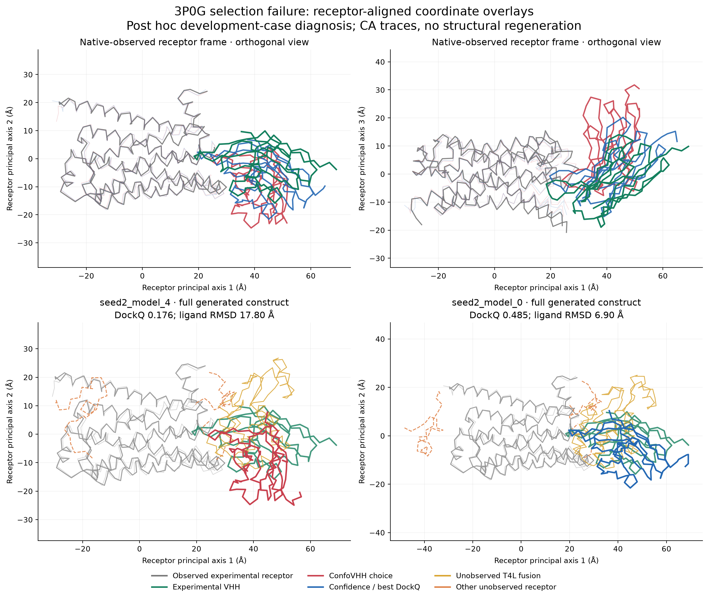

# Completed frozen 3P0G pilot: negative selection result and failure analysis

Completed 9 September 2026; post-outcome analysis 10 September 2026 UTC.
Execution ID: `confovhh-3p0g-startup-recovery-20260909-03`.

**The original negative result is reproduced, not replaced.** All ten candidates
succeeded and have coordinates, confidence and DockQ. ConfoVHH chose
`seed2_model_4` at DockQ **0.1762564824406321**. Maximum predictor confidence
and best available DockQ both chose `seed2_model_0` at
**0.48462880897372757**. The difference is **−0.30837232653309543**.
All three selection sets are singletons; there are no hidden ties, failures or
missing results in this completed pool. No new GPU generation, replacement
candidate, coordinate optimization or scoring change was used for this analysis.

This is one previously exposed **development case**, not independent validation
and not the separate frozen-v3 evaluation. The ten samples do not represent ten
independent biological cases. Historical 165-model/33-job results and all
previous infrastructure failures remain separate and unchanged.

## Independent frozen-ranking reproduction

[The CPU replay receipt](reproduction/reproduction-receipt.json) reports PASS.
The new input manifest was reconstructed from the original generation receipt;
all ten IDs, seed/model identities, coordinate/confidence SHA-256 values, model 1,
A501 receptor/B126 VHH sequences and complete backbones were verified by a
separate mmCIF parser. All 41 protocol-frozen source/dependency identities and
all 51 original evaluation artifacts matched their recorded bytes. The unchanged
frozen scorer was then run on the coordinates: every audit, structure record,
audit policy and scientific rank matched the original. An independent float64
atom-distance calculation matched all contact and severe-clash counts, with
maximum-overlap differences below 1e-12 Å.

This reproduces the frozen burial computation; it is not a second implementation
of the SASA algorithm. The source-bound result, independent raw-distance ledger,
identities and full exact table are preserved in [reproduction/](reproduction/).
The original summary receipt's `coordinateBytesReaudited: false` remains
unchanged because that summary itself only consumed receipts. The fresh replay
provides separate evidence that coordinates were actually re-audited.

## All ten candidate outcomes

Every row is successful, with no missing coordinate, confidence, audit or DockQ
value. Area below is the exact stored **half-delta-SASA** in Ų used to rank,
without display rounding. Clash counts are distinct receptor/VHH residue pairs
with at least one noncovalent heavy-atom Bondi overlap ≥0.6 Å; they are not
counts of all overlapping atom pairs. Product contacts use distance ≤4.5 Å.
Confidence is Boltz's whole A/B/C `confidence_score`, higher better; DockQ
compares protein A:B. PAE and per-atom confidence were uniformly omitted from
frozen ConfoVHH scoring even though the original PAE files were preserved.
Confo rank is one-based; original dense exported tiers are zero-based.

| Candidate | Evidence (tier) | Exact half-delta-SASA (Ų) | Clash pairs | Max overlap (Å) | Residue contacts | Atom contacts | Receptor/VHH residues | Confidence | DockQ | Confo rank |
|---|---|---:|---:|---:|---:|---:|---|---:|---:|---:|
| seed1_model_0 | mixed (1) | 1367.632311505746 | 6 | 0.7496126106359466 | 68 | 398 | 35/31 | 0.8893769383430481 | 0.41451984199389164 | 7 |
| seed1_model_1 | mixed (1) | 1381.2205453445376 | 6 | 0.6787815494530967 | 69 | 428 | 34/34 | 0.8619559407234192 | 0.3757359167773013 | 6 |
| seed1_model_2 | mixed (1) | 1164.721862013725 | 7 | 0.7497357614947147 | 52 | 269 | 22/30 | 0.8491935729980469 | 0.20782171517087225 | 9 |
| seed1_model_3 | mixed (1) | 1027.3088663810124 | 2 | 0.6631136327043663 | 48 | 259 | 25/26 | 0.8466022610664368 | 0.20512446299198026 | 10 |
| seed1_model_4 | supported (2) | 928.2626822950779 | 0 | 0.599472986547203 | 41 | 222 | 22/20 | 0.8166805505752563 | 0.17029171132592144 | 2 |
| seed2_model_0 | mixed (1) | 1512.5783279588954 | 6 | 0.7497392535450405 | 83 | 476 | 38/33 | 0.9008827209472656 | 0.48462880897372757 | 3 |
| seed2_model_1 | mixed (1) | 1427.4961344460512 | 4 | 0.6729678614709234 | 73 | 344 | 37/30 | 0.9007269144058228 | 0.45530981662134734 | 4 |
| seed2_model_2 | mixed (1) | 1366.7861739208936 | 1 | 0.755513821495752 | 72 | 376 | 36/30 | 0.89376300573349 | 0.4766947196533409 | 8 |
| seed2_model_3 | mixed (1) | 1425.927814086937 | 5 | 0.6786065418429477 | 72 | 400 | 35/34 | 0.8840752840042114 | 0.4216895163471448 | 5 |
| seed2_model_4 | supported (2) | 1058.4596798033813 | 0 | 0.5037578092964918 | 46 | 268 | 22/25 | 0.8201104402542114 | 0.1762564824406321 | 1 |

[Exact CSV](reproduction/candidate-table.csv) · [JSON with every input hash](reproduction/candidate-table.json)

## Precisely why seed2_model_4 ranked first

The ranking is lexicographic, **evidence tier descending, then exact burial
descending**. Supported has tier 2; mixed has tier 1. Candidate IDs do not break
scientific ties. All ten candidates pass the contact and completeness floors,
but supported requires zero severe-clash residue pairs. Therefore:

1. `seed2_model_4` has key **(2, 1058.4596798033813)**.
2. `seed1_model_4` has key **(2, 928.2626822950779)**, so the former wins on area.
3. `seed2_model_0`, the best available and confidence winner, has key
   **(1, 1512.5783279588954)**. The first comparison, **2 > 1**, already rejects it;
   its larger area cannot cross the tier boundary.

The other eight poses all have 1–7 reported severe-clash pairs and are mixed.
Every one has higher DockQ than both supported poses. All six candidates at
DockQ ≥0.23 are mixed. The observed failure is dominated by the categorical
zero-clash gate, then by greater burial between two inaccurate supported poses.
It is not a reversed burial direction, swapped chain or filename mismatch.

The second-best DockQ pose, `seed2_model_2`, loses the supported tier because of
one measured pair: LEU A408 CD2–VAL B103 CG1, distance
2.6444861785042475 Å and overlap 0.7555138214957524 Å. The runner-up
`seed1_model_4` has maximum overlap 0.599472986547203 Å, only about 0.000527 Å
below the frozen threshold. These demonstrate the policy's discontinuity in
this case; no threshold was adjusted. Full source anchors and atom-pair details
are in [ranking-failure-analysis.md](ranking-failure-analysis.md).

## Receptor-aligned inspection and construct limitations



The overlay was inspected in two orthogonal views, fitting only the 1,136
matched N/CA/C/O atoms of the 284 experimentally observed receptor residues.
The VHH was never fitted. The selected VHH is displaced and rotated at broadly
the same receptor face; this is a wrong detailed docking orientation/contact
pattern, not evidence of opposite-side binding. Exact-label VHH backbone RMSD
after receptor fitting is **17.795 Å** for ConfoVHH versus **6.896 Å** for
confidence/best. Native-contact recovery at the separate DockQ 5 Å cutoff is
**13/51 versus 31/51**. The corresponding native-contact counts reproduce DockQ.

The receptor is a full 501-residue engineered beta2AR–T4 lysozyme construct.
The reference observes A31–235 and A402–480 only; A1–30, A236–401 and
A481–501 are unobserved. The entire T4L insertion A239–398 is unobserved.
Chain B observes B2–122 out of126. Exact deposited label positions were checked
against author numbering and the frozen sequences; A/B roles are correct.

| Selection | Observed receptor contacts / clashes | Other unobserved receptor contacts / clashes | Unobserved T4L contacts / clashes |
|---|---:|---:|---:|
| ConfoVHH seed2_model_4 | 25 / 0 | 3 / 0 | 18 / 0 |
| Confidence/best seed2_model_0 | 54 / 1 | 8 / 1 | 21 / 4 |

Neither contacts the engineered N-terminal tag. Four of the best pose's six
clash pairs arise in T4L and one in another unobserved segment. One remains
in the experimentally observed interface: receptor label405 (author His269)
against VHH Phe29, with maximum overlap 0.7497392535 Å. Therefore the
unobserved construct contributes strongly to the demotion, but removing those
clashes alone would not remove the zero-clash disadvantage. The second-best
pose's single A408/B103 pair is also in the observed interface.

The score includes buried area, contacts and clashes from all generated A/B
residues. The reference cannot establish generated T4L contacts as correct or
incorrect. Meanwhile, the loss of observed native contacts and displaced VHH
support the negative placement finding. Neither a large area nor a clean clash
proxy establishes native-interface recovery. The separately audited observed
native reference has area865.0401433789232 Ų,46 product contacts and zero
severe clashes; it is excluded from the candidate pool, and its smaller residue
inventory prevents a fair full-construct area comparison.

[Detailed structural diagnosis](geometry/README.md) ·
[Contact maps](geometry/interface-contact-maps.png) ·
[All-ten regional census](geometry/regional-contact-clash-census.csv) ·
[Deposited-to-predicted mapping](geometry/residue-mapping.json)

## Mapping finding: original and explicit-label diagnostic retained

DockQ's frozen sequence alignment maps all284 observed receptor positions and
119 core VHH positions correctly. Two identical terminal histidines are
ambiguous: native B121/122 map to model B125/126 rather than B121/122. This is
a repeat-tag evaluation mapping limitation, not a chain-role swap or a
ConfoVHH scoring implementation bug.

A separate post-outcome calculation uses unchanged protein coordinates and the
same DockQ2.1.3 implementation, renumbers the reference to deposited label
positions and uses numbering-based alignment (`no_align=True`). This changes
only the evaluation correspondence; it does not replace the frozen result:

| Selection | Original frozen DockQ | Explicit deposited-label diagnostic DockQ |
|---|---:|---:|
| ConfoVHH seed2_model_4 | 0.1762564824406321 | 0.1769118036045605 |
| Confidence seed2_model_0 | 0.48462880897372757 | 0.4867453599181881 |
| Best available seed2_model_0 | 0.48462880897372757 | 0.4867453599181881 |

All ten native-contact counts and interface RMSDs are unchanged. Maximum
absolute DockQ change is0.0032699581611960182; the best candidate and all
selection sets remain unchanged. The [all-ten original/diagnostic table](geometry/dockq-label-mapping-sensitivity.csv)
retains both values. It does not explain away the selection failure. No scoring
implementation correction was warranted in the reproduced path. Any new clash
rule, region mask, PAE/confidence term or score based on this diagnosis would
be exploratory development requiring prospective evaluation on **new held-out
cases**. No such redesigned selector is evaluated or validated here.

## Execution and preservation record

The immutable experiment used source commit
`335617ae2744d8e9061464bafd62e166209d8c46`, recovery commit
`250350ab4b995e075edcb489c4f183e32b35efd6` and operations commit
`78db59ba2a200d3e908d48b53b4addd721991b81`. Its unchanged protocol SHA-256 is
`8d3174f717ede953d922466cec93e5397ff443474da6c8addbc904ce8fc8d6e9`.
The runtime was isolated Python3.11.13/Boltz2.2.1/Torch2.7.1+cu126/Triton3.3.1,
using exact base image
`docker.io/pytorch/pytorch@sha256:2b59b1b91885677814f78be1f8df48a25d5dc952eb6580eaecfefca510f9afd3`.
All original CPU/GPU locks remain under `cloud/boltz-runtime-candidate`.
The external original runtime check, full GPU Triton JIT gate and runner's
internal runtime check passed before inference. The ten-candidate execution
used seeds1/2, five samples each, three recycles,200 sampling steps, step1.5,
max_parallel_samples5 and potentials as frozen. There were no native-coordinate
or template inputs to generation.

The generation receipt spans1401.480499 s including cache reconstruction and
internal checks. The two prediction commands took257.1197800952941 s and
252.15736181288958 s, totaling509.2771419081837 s. These are distinct from
cumulative GPU-allocation time. The original first-candidate API/CLI DockQ
crosscheck is PASS with difference0.0 at tolerance1e-6. Original controller,
backup and final-pod receipts are included; the recorded final pod list is empty.
This analysis incurred no GPU time or charges.

| Historical execution | Preserved disposition | Coordinates |
|---|---|---:|
| Initial A100 attempt | 10 original failed attempts; missing C compiler and interrupted following work | 0 |
| Compiler-recovery runtime failure | 10 blocked/not-run slots; original timeout and diagnosis retained | 0 |
| Startup recovery execution01 | 10 not-run slots; preparation controller exception | 0 |
| Startup recovery execution02 | 10 not-run slots; no inference pending time allowance | 0 |
| Startup recovery execution03 | 10 generated, audited, confidence-present and DockQ-scored candidates | 10 |

Earlier attempts are retained as infrastructure history, not merged into the
completed scientific pool and not replaced or rewritten. The byte-preservation
manifest covers the original evaluation, generation/raw outputs, runtime,
reference and history files. All ten coordinates, confidence files, full PAE
matrices and other saved raw prediction outputs are included. A separate
[versioned manuscript evidence record](../../../paper/evidence/single-case-3p0g-selection-failure-2026-09-09/claim-evidence-v1.json)
binds these files and new analyses without rewriting the older claim ledger.

## CPU-only replay

First verify the committed evidence with Python's standard library:

```sh
python3 scripts/paper/verify-single-case-pilot-evidence.py
```

For numeric replay, use Node24.19.0 and a checkout at the exact frozen commit
335617a with its pinned npm dependencies (`npm ci --ignore-scripts`). Use
Python3.12.14 with [the separately recorded analysis dependencies](analysis-python-requirements.txt).
These CPU analysis requirements do not replace the Python3.11 GPU locks.
From the integration repository, with `FROZEN_REPO` set to that frozen checkout
and `PYTHON` set to the analysis interpreter, use new empty output directories:

```sh
CASE=validation/single-case-development-3p0g-2026-09-09
PILOT=$CASE/completed-pilot-execution03
"$PYTHON" scripts/paper/reproduce-single-case-pilot-ranking.py   --repo "$FROZEN_REPO" --evaluation "$PILOT/original-evaluation"   --generation "$PILOT/generation" --output work/pilot-rank-replay --node node
"$PYTHON" scripts/paper/analyze-single-case-pilot-geometry.py   --evaluation "$PILOT/original-evaluation" --case "$CASE/case"   --reference "$PILOT/reference/3P0G.cif"   --native-protein "$PILOT/reference/native_AB.pdb" --output work/pilot-geometry-replay
node scripts/paper/single-case-native-diagnostic.mjs   "$FROZEN_REPO" "$PILOT/reference/native_AB.pdb" work/pilot-native-diagnostic.json
```

The raw-to-rank replay refuses a different frozen source commit or changed
input identities. Rerun timestamps can change receipt-level hashes while exact
scientific audits/ranks remain equal. The geometry program uses only existing
coordinates and produces new overlays and a separately named mapping
sensitivity. Neither program launches Boltz predictions or allocates a pod.
