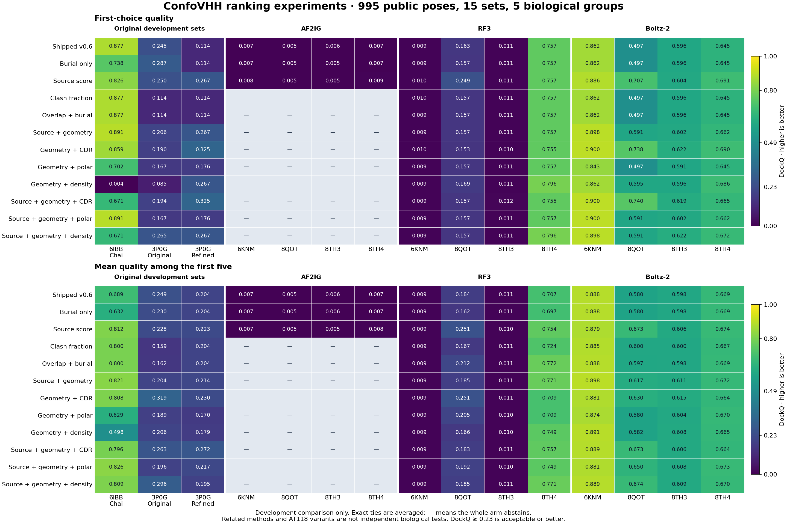

# ConfoVHH source and interface ranking experiments v2

Completed: 995 original public poses, 15 selection sets, five receptor–nanobody groups, 12 fixed methods and a separate two-method membrane ablation. All 995 reference evaluations and independent raw-coordinate checks passed. No production default changed.

## Decision

The added interface features improve particular cases but do not establish a universal replacement score. Source-only ranking selects an acceptable-or-better first pose in 9 of 15 sets, compared with 7 of 15 for shipped v0.6. Six sets contain no acceptable pose at all, so 9 is the binary first-choice ceiling on this panel. These are descriptive counts of related selection sets, not independent biological success rates. All seven new methods rank 11 sets and abstain on the four AF2IG sets under the frozen missing-feature rule. Their abstentions are not silently counted as successes or dropped from a claimed overall rate.

Keep source confidence as an explicit baseline and test context features separately. The current results reject replacing it with any one tested fixed combination across all input methods. They support continued development of CDR-contact and supplied-membrane features, with target-level independent evaluation before a default change.

## What improved and what failed

- Refined 3P0G: source + geometry + CDR (`H-paratope`) raises first-choice DockQ from shipped 0.114 and source-only 0.267 to 0.325. Its first five are all acceptable or better, versus three of five for both controls. On original 3P0G, however, it selects DockQ 0.194, below the acceptable threshold and below source-only 0.250.
- Boltz 8QOT: `H-paratope` selects DockQ 0.740 versus shipped 0.497 and source-only 0.707. On RF3 8QOT, the same rule selects 0.157 versus source-only 0.249. Thus even the same receptor/Nb pair can reverse the result across modeling methods.
- The membrane collision proxy improves original LightDock geometric AUROC from 0.726 to 0.824 and first-choice DockQ from 0.114 to 0.245. Its source hybrid improves top-five mean DockQ from 0.204 to 0.256; source-only is 0.228. Source-only still leads this membrane hybrid on AUROC, first choice and top ten. This test applies to one ensemble with supplied phosphate beads.
- The polar-contact and contact-density additions do not give a consistent gain. For example, geometry + density selects an incorrect 6IBB pose with DockQ 0.004. All negative results remain in the full table.
- All 200 released AF2IG poses are below acceptable quality, and 199 have no 4.5 Å interchain contacts. RF3 6KNM and 8TH3 also contain no acceptable pose. Ranking alone cannot produce an absent correct solution. This describes these released collections, not every use of their prediction methods.

## First-choice quality across every set

DockQ is higher-is-better; acceptable ≥ 0.23, medium ≥ 0.49, high ≥ 0.80. Exact selection ties are averaged. “Abstain” retains all planned poses. The displayed candidate is the prespecified CDR hybrid; every other method is included in the linked full metrics and figure.

| Set | Poses | Acceptable or better available | Shipped | Source only | Source + geometry + CDR |
|---|---:|---:|---:|---:|---:|
| champloo_6ibb | 195 | 127 | 0.877 | 0.826 | 0.671 |
| lightdock_original_3p0g | 100 | 18 | 0.245 | 0.250 | 0.194 |
| lightdock_refined_3p0g | 100 | 17 | 0.114 | 0.267 | 0.325 |
| junker-6KNM-af2ig | 50 | 0 | 0.007 | 0.008 | Abstain |
| junker-8QOT-af2ig | 50 | 0 | 0.005 | 0.005 | Abstain |
| junker-8TH3-af2ig | 50 | 0 | 0.006 | 0.005 | Abstain |
| junker-8TH4-af2ig | 50 | 0 | 0.007 | 0.009 | Abstain |
| junker-6KNM-rf3 | 50 | 0 | 0.009 | 0.010 | 0.009 |
| junker-8QOT-rf3 | 50 | 20 | 0.163 | 0.249 | 0.157 |
| junker-8TH3-rf3 | 50 | 0 | 0.011 | 0.011 | 0.012 |
| junker-8TH4-rf3 | 50 | 50 | 0.757 | 0.757 | 0.755 |
| junker-6KNM-boltz | 50 | 50 | 0.862 | 0.886 | 0.900 |
| junker-8QOT-boltz | 50 | 48 | 0.497 | 0.707 | 0.740 |
| junker-8TH3-boltz | 50 | 50 | 0.596 | 0.604 | 0.619 |
| junker-8TH4-boltz | 50 | 50 | 0.645 | 0.691 | 0.665 |

[All 180 method/set rows](v2-results/all-metrics.csv) · [Figure PDF](v2-results/ranking-quality.pdf)

## Study boundary and source provenance

The original 395 poses cover SUCNR1–Nb6 and ADRB2–Nb80. Original and refined 3P0G share one biological system. The additional 600 predictions cover APLNR–JN241, OPRM1–NbE and AGTR1–AT118; 8TH3/8TH4 are related AT118 variants. Five groups and 15 method/construct sets do not make 15 independent targets. All groups are development-exposed; there is no independent holdout claim. No weights were fitted and no pose-level random split or significance test was used.

The additional data are the four nanobody constructs from [Junker and Schoeder (PLOS One, 2026)](https://journals.plos.org/plosone/article?id=10.1371/journal.pone.0355549), pinned to [Zenodo 20688660](https://doi.org/10.5281/zenodo.20688660), CC-BY-4.0. All 600 source coordinates/scores were recovered, all three full archive MD5s matched, and all native reference pairs matched RCSB coordinates after one common rigid transform. This is native-receptor-template cofolding without MSA. AF2IG/RF3 retain resolved receptor constructs/fusions; Boltz uses its original full-length receptor inputs. Source constructs, residue ordering and truncations were preserved; no new poses, native masks, trimming or substitutions were introduced.

AF2IG uses lower-is-better pae_interaction; Boltz uses higher-is-better confidence_score. RF3 uses an explicitly reconstructed ranking score from archived prediction fields and pinned newer official code; it is not an original archive-native scalar, and version drift remains a limitation. The modified AF2IG wrapper was not archived, limiting byte-exact producer reconstruction. Source adapters contain only prediction scores.

## Feature and membrane interpretation

P is total-interface CDR contact share under the frozen IMGT numbering policy. In 191/195 Champloo poses the interface touches unnumbered VHH extensions. P can therefore reject extension-mediated contacts as well as favor CDR engagement; its effect does not establish better CDR packing. F counts distance-qualified polar atom contacts per residue pair and is not a hydrogen-bond energy or a bounded fraction. D is nonclashing contact-pair density per half-delta-SASA burial area.

Membrane orientation comes only from the original prediction-side receptor and supplied phosphate beads. The receptor-only alignment and 2 Å fit gate were frozen before scoring. The scalar measures Nb heavy atoms within 2.5 Å of a bead; it does not reconstruct a membrane core or binding side. All 100 original LightDock poses qualify. Champloo has no supplied membrane frame. Four raw refined files have grossly distorted receptor coordinates; the entire refined set abstains rather than dropping them. The full membrane report is included in the local replay archive.

## Verification and reproducibility

- Twelve Node and eight Python tests passed, including ties, shuffling, missingness, source identity, outcome injection and malformed membership.
- All 995 coordinate inventories, contact/clash counts and overlap censuses were independently checked. The 600 new cases also received independent polar/salt atom and P/F/D arithmetic reconciliation. Burial/SASA uses the frozen engine; it is not claimed to be independently reimplemented.
- All 995 pose feature records, 6,965 new method/pose keys and ranks, and available top1/top5/top10 windows were independently reconstructed without importing the scorer or evaluator. Six adversarial scientific changes were rejected even after their receipt hashes were recomputed.
- DockQ 2.1.3 evaluated all 995 unchanged coordinates with fixed chain roles and default sequence alignment. CLI/API checks agreed on each of 15 sets. New-cohort score/rank receipts precede reference evaluation.
- Validation hardening changed no formulas or results: the original 395 feature, rank, attempt and percentile files replayed byte-for-byte. A group display-name transcription error (Nb8 → Nb6) was corrected without changing grouping or metrics; initial artifacts are retained as diagnostics.

The portable evidence archive contains all selected coordinates, source adapters, sealed audits/ranks, reference outcomes, source provenance and replay code. Full multi-target download archives and environment caches are excluded; their published integrity receipts remain. See [archive details](ARCHIVE.md) and the verification receipt. Replay instructions and all raw audit outputs are included in the local full archive. All work ran on local CPU; this task created no cloud resource.

This review contains the selector/evaluator, tests, frozen protocol, per-set metrics, figure and archive proof. Full audits and recovery files remain in the verified 219 MB local evidence archive.
